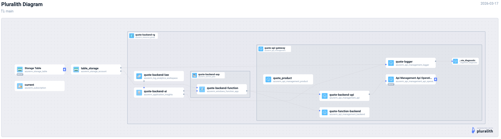

# Azure Infrastructure Setup

This directory contains the Terraform configuration for deploying the Azure backend infrastructure with self-hosted JWT authentication and API Gateway.

## Table of Contents

- [Prerequisites](#prerequisites)
- [Setup Steps](#setup-steps)
- [Variables](#variables)
- [Architecture Overview](#architecture-overview)
- [Security Notes](#security-notes)
- [Outputs](#outputs)
- [Frontend Integration](#frontend-integration)
- [Troubleshooting](#troubleshooting)

## Pluralith Diagram

This diagram is generated by pluralith from the terraform code. It can be regenerated from the commandline by running the following commands in the infrastructure folder:
```shell
terraform init
pluralith graph --local-only
```



## Prerequisites

- Azure CLI installed and configured
- Terraform installed
- Appropriate Azure permissions (Contributor level on subscription)
- **Remote backend setup**: See [README-backend.md](./README-backend.md) for Terraform state backend configuration

## Setup Steps

### 1. Configure Remote Backend (First Time Only)

Before initializing Terraform, set up the remote backend to store state securely in Azure:

1. Run the backend setup script:
   ```bash
   ./setup-backend.sh
   ```

2. Create your local `backend.tf` file (see [README-backend.md](./README-backend.md) for details)

3. Initialize Terraform with backend migration:
   ```bash
   terraform init -migrate-state
   ```

### 2. Initialize Terraform (After Backend Setup)
```bash
terraform init
```

### 3. Configure Variables

Copy the template file and fill in your values:
```bash
cp terraform.tfvars.template terraform.tfvars
```

Edit `terraform.tfvars` with your specific values (see Variables section below).

### 4. Deploy Infrastructure

Deploy all resources including the API Gateway:
```bash
terraform apply
```

### 5. Create Default Admin User

After deployment, create an admin user using the seeded endpoint:
```bash
# Get the function URL from Terraform outputs
FUNCTION_URL=$(terraform output function_app_url | tr -d '"')

# Create admin user (replace with your details)
curl -X POST "https://${FUNCTION_URL}/api/seed-users" \
  -H "Content-Type: application/json" \
  -d '{
    "email": "admin@example.com",
    "username": "admin",
    "password": "YourSecurePassword123!"
  }'
```

### 6. Deploy Application Code

Deploy the Azure Functions with JWT authentication:
```bash
cd ../src
dotnet build --configuration Release
func azure functionapp publish quote-backend-function
```

### 7. Configure API Gateway JWT Validation

After deployment, you need to update the API Gateway with your JWT signing key:

1. Go to Azure Portal → API Gateway → quote-api-gateway
2. Navigate to APIs → quote-backend-api
3. Go to Inbound processing
4. Edit the JWT validation policy
5. Replace `{{jwt-signing-key}}` with your actual JWT key from local.settings.json

### 8. Test Authentication

Test the JWT authentication endpoints:
```bash
# Get API Gateway URL
API_URL=$(terraform output api_gateway_url | tr -d '"')

# Register a new user
curl -X POST "${API_URL}/auth/register" \
  -H "Content-Type: application/json" \
  -d '{
    "email": "user@example.com",
    "username": "testuser",
    "password": "User123!",
    "confirmPassword": "User123!"
  }'

# Login to get JWT token
TOKEN=$(curl -s -X POST "${API_URL}/auth/login" \
  -H "Content-Type: application/json" \
  -d '{
    "email": "user@example.com",
    "password": "User123!"
  }' | jq -r '.token')

# Test API with token
curl -H "Authorization: Bearer ${TOKEN}" "${API_URL}/quote"
```

## Variables

### terraform.tfvars Configuration

Add these variables to your `terraform.tfvars` file:

```hcl
# Storage Configuration
table_storage_account_name = "your-storage-account-name"  # Your existing storage account name

# JWT Configuration (generate your own secure key)
jwt_signing_key = "your-super-secret-jwt-key-that-is-at-least-256-bits-long"

# API Gateway Configuration
api_gateway_publisher_email = "admin@example.com"  # Your email for API Gateway notifications

# Optional: Override defaults if needed
location = "West Europe"
resource_group_name = "quote-backend-rg"
function_app_name = "quote-backend-function"
```

### How to Obtain Values

| Variable | Description | How to Obtain/Generate |
|-----------|-------------|------------------------|
| `table_storage_account_name` | Existing storage account name | Use your current storage account name |
| `jwt_signing_key` | Secret key for JWT token signing | Generate a cryptographically secure random string (at least 256 bits) |
| `api_gateway_publisher_email` | Email for API Gateway notifications | Use your admin email address |

#### Generating a Secure JWT Key

Use one of these methods to generate a secure JWT signing key:

**Option 1: Using OpenSSL (recommended)**
```bash
openssl rand -base64 32
```

**Option 2: Using PowerShell**
```powershell
Add-Type -AssemblyName System.Web
[System.Web.Security.Membership]::GeneratePassword(32, 5)
```

**Option 3: Using Python**
```python
import secrets
print(secrets.token_urlsafe(32))
```

**Option 4: Using an online generator**
- Visit https://randomkeygen.com/ or similar
- Generate a 256-bit key
- Ensure it's URL-safe and Base64 encoded

### Optional Variables

| Variable | Default | Description |
|-----------|---------|-------------|
| `location` | "West Europe" | Azure region for deployment |
| `resource_group_name` | "quote-backend-rg" | Resource group name |
| `function_app_name` | "quote-backend-function" | Function app name |
| `api_gateway_name` | "quote-api-gateway" | API Gateway name |

## Architecture Overview

The deployed infrastructure includes:

1. **Function App**: Serverless functions with JWT authentication
2. **API Gateway**: Secure proxy with automatic master key injection
3. **Storage Account**: Tables for quotes, users, and user activity
4. **Application Insights**: Monitoring and logging

### API Gateway Benefits

- **Security**: Master key never exposed to frontend
- **Authentication**: JWT validation at gateway level
- **Rate Limiting**: 100 calls/minute per IP
- **CORS**: Centralized cross-origin configuration
- **Logging**: Request/response logging to Application Insights

## Security Notes

- `terraform.tfvars` contains sensitive information and is gitignored
- Never commit secrets to version control
- Use a strong, randomly generated JWT signing key
- Regularly rotate the JWT signing key
- The API Gateway automatically handles master key security

## Outputs

After deployment, you can retrieve important values:

```bash
# Function App URL (direct access)
terraform output function_app_url

# API Gateway URL (recommended for frontend)
terraform output api_gateway_url

# Resource Group Name
terraform output resource_group_name

# Storage Account Name
terraform output storage_account_name
```

## Frontend Integration

Update your frontend configuration to use the API Gateway:

```javascript
// Use the API Gateway URL instead of direct Function App URL
const API_BASE_URL = "https://quote-api-gateway.azure-api.net/quote";
```

## Troubleshooting

### Common Issues

1. **JWT validation errors**: Ensure the JWT key in API Gateway matches your application settings
2. **CORS errors**: Check that your frontend domain is in the allowed origins list
3. **Rate limiting**: Monitor API usage and adjust limits if needed
4. **Authentication failures**: Verify JWT token format and expiration

### Useful Commands

```bash
# Check Terraform state
terraform state list

# View Terraform outputs
terraform output

# Check Function App logs
az webapp log tail --resource-group quote-backend-rg --name quote-backend-function

# Test API Gateway directly
curl -H "Authorization: Bearer <token>" https://quote-api-gateway.azure-api.net/quote

# Monitor Application Insights
az monitor app-insights query --app quote-backend-ai --analytics-query "requests | where timestamp > ago(1h)"
```
