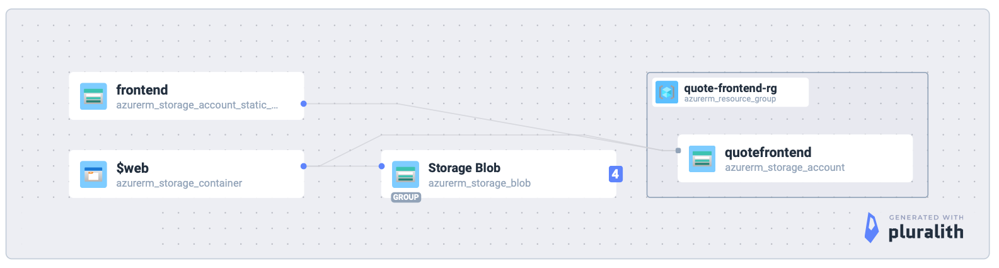

# Frontend Infrastructure with Terraform

This directory contains the Terraform configuration for deploying the quote-azure-frontend as a static website on Azure Storage using your existing storage account for frontend files, with a dedicated storage account for Terraform state management.

## Table of Contents

- [🏗️ Architecture](#️-architecture)
  - [Infrastructure Components](#infrastructure-components)
  - [Data Flow](#data-flow)
  - [Security Features](#security-features)
- [Prerequisites](#prerequisites)
  - [Terraform State Storage](#terraform-state-storage)
- [🚀 Quick Start](#-quick-start)
  - [Deploy Frontend Infrastructure](#deploy-frontend-infrastructure)
- [Quick Setup Script](#quick-setup-script)
- [Manual Deployment Steps](#manual-deployment-steps)
  - [1. Initialize Terraform](#1-initialize-terraform)
  - [2. Plan the Deployment](#2-plan-the-deployment)
  - [3. Apply the Configuration](#3-apply-the-configuration)
- [File Structure](#file-structure)
- [Resources Created](#resources-created)
- [Configuration Options](#configuration-options)
  - [Basic Configuration](#basic-configuration)
  - [Custom Domain](#custom-domain)
- [Outputs](#outputs)
- [Environment Variables](#environment-variables)
- [Cleanup](#cleanup)

## 🏗️ Architecture

Simple static website hosting on Azure Storage:

```
React App → GitHub Actions → Azure Storage ($web container) → Users
     ↓              ↓                    ↓
  Build files    Terraform        HTTPS endpoint
```

### Pluralith Diagram

This diagram is generated by pluralith from the terraform code. It can be regenerated from the commandline by running the following commands in the infrastructure folder:
```shell
terraform init
pluralith graph --local-only
```



### Infrastructure Components

- **Azure Storage Account**: Hosts static website files
- **$web Container**: Default container for static website hosting  
- **Terraform State Storage**: Separate storage for state management
- **GitHub Actions**: Automated CI/CD pipeline for deployment
- **CORS Configuration**: Secure cross-origin resource sharing

### Data Flow

1. **Development**: React app → `npm run build` → `dist/` folder
2. **Deployment**: GitHub Actions → Terraform → Azure Storage
3. **Access**: Users → HTTPS → Static website → React app

### Security Features

- **HTTPS Only**: Azure Storage enforces secure connections
- **CORS Protection**: Limited to specific domains
- **State Isolation**: Separate storage account for Terraform state
- **Access Control**: Service Principal authentication for deployments

## Prerequisites

### Terraform State Storage

Create a separate storage account for frontend Terraform state:

1. **Create resource group for frontend state**:
   ```bash
   az group create --name quote-frontend-rg --location westeurope
   ```

2. **Create storage account for frontend state**:
   ```bash
   az storage account create \
     --name quotefrontendstate \
     --resource-group quote-frontend-rg \
     --location westeurope \
     --sku Standard_LRS \
     --kind StorageV2
   ```

3. **Create frontend state container**:
   ```bash
   az storage container create \
     --name terraform-state-frontend \
     --account-name quotefrontendstate \
     --auth-mode login
   ```

4. **Configure Terraform backend**:
   ```bash
   # Copy the template and update with your values
   cp backend.tf.template backend.tf
   
   # Edit backend.tf to use the new frontend state storage:
   # - storage_account_name: quotefrontendstate
   # - resource_group_name: quote-frontend-rg
   # - container_name: terraform-state-frontend
   # - key: frontend-infrastructure.tfstate
   nano backend.tf
   ```

## Quick Start

### Deploy Frontend Infrastructure

1. **Configure Frontend Storage Account**:
   ```bash
   cd quote-azure-frontend/infrastructure
   
   # Copy terraform variables template
   cp terraform.tfvars.template terraform.tfvars
   
   # Edit terraform.tfvars with your storage account details
   nano terraform.tfvars
   ```

2. **Update terraform.tfvars**:
   ```hcl
   use_existing_storage_account = true
   frontend_storage_account_name = "your-storage-account-name"
   frontend_resource_group_name = "your-resource-group-name"
   location = "westeurope"  # Match your existing storage account location
   ```

3. **Deploy**:
   ```bash
   # Make the deploy script executable
   chmod +x deploy.sh
   
   # Run deployment
   ./deploy.sh
   ```

## Quick Setup Script

For automated setup of frontend infrastructure:
```bash
cd quote-azure-frontend/infrastructure
./setup-frontend-infrastructure.sh
```

This script will:
- Prompt for your existing storage account details (for frontend files)
- Verify the storage account exists
- Create terraform.tfvars automatically
- Set up backend.tf for dedicated state storage
- Guide you through the remaining steps

**Note**: You still need to create the separate state storage account first (see Prerequisites).

## Manual Deployment Steps

### 1. Initialize Terraform
```bash
terraform init
```

### 2. Plan the Deployment
```bash
terraform plan
```

### 3. Apply the Configuration
```bash
terraform apply
```

## File Structure

```
infrastructure/
├── backend.tf.template    # Backend configuration template
├── main.tf               # Main resources (storage account, CDN)
├── variables.tf          # Input variables
├── outputs.tf            # Output values
├── terraform.tfvars.template # Environment variables template
├── deploy.sh             # Deployment script
├── setup-frontend-infrastructure.sh # Setup script for existing storage
├── destroy.sh            # Destruction script
└── README.md             # This file
```

## Resources Created

- Static website hosting enabled on existing storage
- $web container created for frontend files
- CORS configuration updated
- Frontend files uploaded to $web container

## Configuration Options

### Basic Configuration
Edit `terraform.tfvars`:
```hcl
# Use existing storage account
use_existing_storage_account = true
existing_storage_account_name = "quote-lambda-tf"
existing_resource_group_name = "quote-lambda-tf-rg"
location = "westeurope"
environment = "dev"
```

### Custom Domain
Add custom domain configuration:
```hcl
custom_domain = {
  domain_name = "quote.yourdomain.com"
  ttl         = 3600
}
```

## Outputs

After deployment, you'll get:
- `resource_group_name`: Name of the resource group (sensitive)
- `storage_account_name`: Name of the storage account (sensitive)
- `storage_account_id`: ID of the storage account
- `static_website_url`: URL of the static website
- `primary_access_key`: Primary access key for uploads (sensitive)
- `connection_string`: Connection string for the storage account (sensitive)

## Environment Variables

The frontend needs to know the backend API URL. Set this in your build process:

```bash
# For production
VITE_API_BASE_URL=https://your-backend-api.azurewebsites.net npm run build

# For development
VITE_API_BASE_URL=http://localhost:7071 npm run build
```

## Cleanup

To remove frontend resources:
```bash
terraform destroy
```

This will remove:
- Frontend files from $web container
- Static website configuration
- Frontend Terraform state from terraform-state-frontend container

**Note**: Your existing storage account, terraform-state container (backend), backend data, and quote-frontend-rg resource group (containing state storage) will remain untouched.
