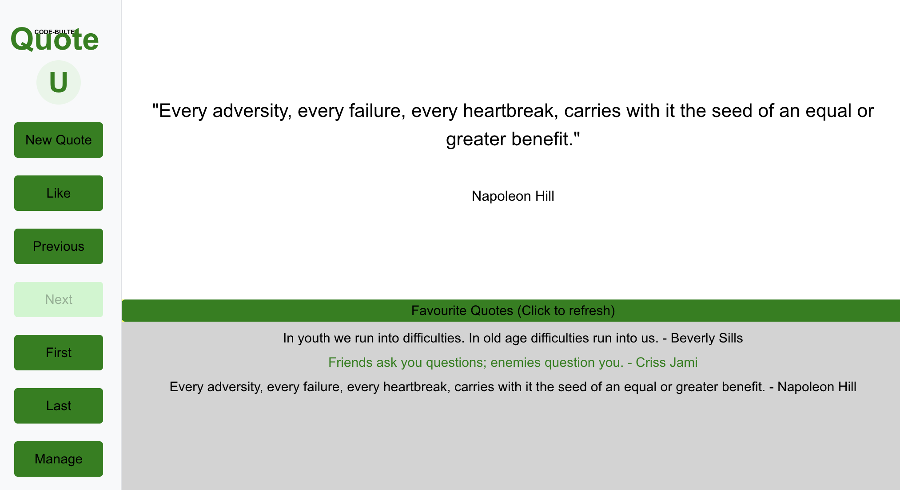

# Quote Frontend

This web app uses the [quote-lambda-tf-backend](../quote-lambda-tf-backend/README.md) API for showing and liking quotes from [ZenQuotes.io](https://zenquotes.io/)


## Table of Contents

- [Features](#features)
- [Tech Stack](#tech-stack)
- [API Integration](#api-integration)
- [Live Demo](#live-demo)
- [Getting Started](#getting-started)
- [Development](#development)
  - [Available Scripts](#available-scripts)
- [Testing](#testing)
  - [Playwright End-to-End Tests](#playwright-end-to-end-tests)
    - [Available Test Suites](#available-test-suites)
    - [Run all tests](#run-all-tests)
    - [Run tests in UI mode](#run-tests-in-ui-mode)
    - [Run a specific test file](#run-a-specific-test-file)
    - [Run tests in headed mode](#run-tests-in-headed-mode)
    - [View test report](#view-test-report)
    - [Debug tests](#debug-tests)
    - [Run tests on specific browsers](#run-tests-on-specific-browsers)
    - [CI/CD Integration](#cicd-integration)
- [Deployment](#deployment)
  - [GitHub Actions Workflow](#github-actions-workflow)
    - [Prerequisites](#prerequisites)
    - [Manual Trigger](#manual-trigger)
  - [Infrastructure Deployment](#infrastructure-deployment)
    - [Key Infrastructure Components](#key-infrastructure-components)
    - [First-Time Setup](#first-time-setup)

## Features



Implemented features:
- Favourite Quotes Loading
    - When the screen starts, the liked quotes are fetched and loaded in the Favourite Quotes box
    - The header of the favourite quotes box also functions as a refresh button, which comes in handy if the backend doesn't implement the feed functionality like quote-django backend
- New Quote Button:
    - Requests a new Random quote and sends the ids of all previously received quotes in the request to avoid receiving the same quote again
    - The button is disabled while the new quote is loading (and displays loading...)
- Like Button:
    - Sends a request to like the current quote
    - The button is only enabled if the user is signed in and has the USER role.
    - The button is disabled and displays liking... while the request is being sent
    - The button is disabled and displays Like when the user has already liked the quote
- Walking through the quote history:
    - All quotes received can be watched again, or liked unless the user has already liked it
    - The history can be browsed with the next buttons:
        - Previous Button:
            - Shows the previous quote, when there is one
            - Is disabled if there is no previous quote
        - Next Button
            - Shows the next quote, when there is one
            - Is disabled if there is no next quote
        - First
            - jumps to the first received quote
        - Last
            - jumps to the last received quote

## Tech Stack

- **Frontend Framework**: React 18 with TypeScript
- **Build Tool**: Vite
- **Styling**: CSS Modules & SCSS
- **Testing**: Playwright (E2E)
- **Infrastructure as Code**: Terraform
- **Hosting**: AWS (S3 + CloudFront CDN)
- **CI/CD**: GitHub Actions

## Live Demo

Access the live application at:

**Production Environment:**
> https://d5ly3miadik75.cloudfront.net/

**Development Environment:**
> https://d1fzgis91zws1k.cloudfront.net/

## Getting Started

1. Clone the repository:
   ```bash
   git clone https://github.com/edwinbulter/quote-lambda-tf.git
   cd quote-lambda-tf
   cd quote-lambda-tf-frontend
   ```

2. Install dependencies:
   ```bash
   npm install
   ```

3. Start the development server:
   ```bash
   npm run dev
   ```

4. Open [http://localhost:5173](http://localhost:5173) in your browser.

## Development

### Available Scripts

- `npm run dev` - Start development server
- `npm run build` - Build for production
- `npm run preview` - Preview production build locally
- `npm run test` - Run tests
- `npm run test:watch` - Run tests in watch mode
- `npm run lint` - Run ESLint
- `npm run format` - Format code with Prettier

## Testing

### Playwright End-to-End Tests

The project uses Playwright for end-to-end testing. Tests are located in the `playwright-tests/` directory and automatically start the development server before running.

#### Available Test Suites

- **`open-screen.spec.ts`** - Tests initial screen load and quote display
- **`click-new-quote.spec.ts`** - Tests New Quote button functionality and duplicate request prevention
- **`click-like.spec.ts`** - Tests Like button and Favourite Quotes component integration

#### Run all tests

```bash
npx playwright test
```

#### Run tests in UI mode

UI mode provides an interactive interface to run and debug tests:

```bash
npx playwright test --ui
```

#### Run a specific test file

```bash
npx playwright test open-screen.spec.ts
npx playwright test click-new-quote.spec.ts
npx playwright test click-like.spec.ts
```

#### Run tests in headed mode

To see the browser while tests are running:

```bash
npx playwright test --headed
```

#### View test report

After running tests, view the HTML report:

```bash
npx playwright show-report
```

#### Debug tests

To debug a specific test:

```bash
npx playwright test --debug
```

#### Run tests on specific browsers

```bash
# Run on Chromium only
npx playwright test --project=chromium

# Run on Firefox only
npx playwright test --project=firefox

# Run on WebKit only
npx playwright test --project=webkit
```

#### CI/CD Integration

Playwright tests can be run in GitHub Actions using the workflow file `.github/workflows/playwright.yml`. This workflow can be triggered manually from the GitHub Actions UI.

## Deployment

### GitHub Actions Workflow

The project includes a GitHub Actions workflow [deploy-frontend.yml](../.github/workflows/deploy-frontend.yml) for building and deploying the frontend and a workflow [playwright.yml](../.github/workflows/playwright.yml) for running the Playwright tests.

Look in [doc/github-workflows.md](doc/github-workflows.md) for more information.


### Infrastructure Deployment

The infrastructure is managed using Terraform. Refer to [doc/infrastructure.md](doc/infrastructure.md) for detailed instructions on setting up and managing the AWS resources.

